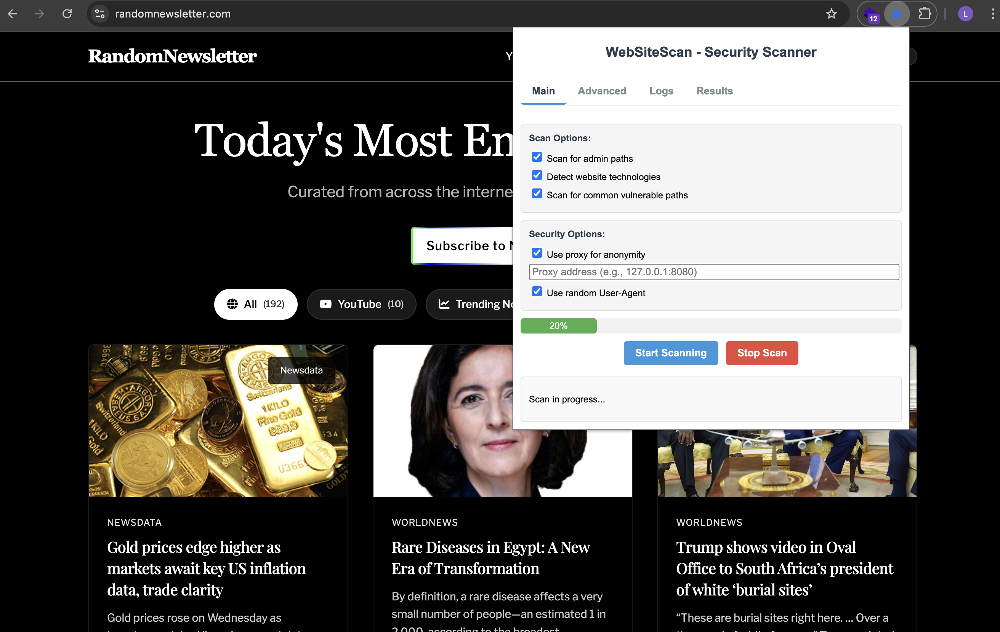

# WebSiteScan - Advanced Security Scanner Chrome Extension

A comprehensive Chrome extension for website security testing and penetration testing that identifies potentially vulnerable paths, technologies, and security issues on websites

## Screenshot

## Features

### Core Scanning Features
- **Admin Path Discovery**: Scans websites for common admin paths and dashboards
- **Technology Detection**: Identifies the frameworks, languages, and libraries used by the website
- **Vulnerability Scanning**: Checks for common vulnerable paths and security issues
- **Custom Path Scanning**: Add your own paths to scan for specific vulnerabilities

### Advanced Testing Features
- **Performance Testing**: Analyze page load time, response size, and resource count
- **Network Analysis**: Examine HTTP headers, security headers, and cookies
- **Stress Testing**: Test website performance under load with configurable requests

### Security Options
- **Anonymity Features**: Random User-Agent rotation and proxy support
- **Detailed Logs**: Real-time logging of scan progress and findings
- **Stop Functionality**: Pause or stop scans at any time

## Installation

1. Download or clone this repository
2. Open Chrome and navigate to `chrome://extensions/`
3. Enable "Developer mode" in the top-right corner
4. Click "Load unpacked" and select the extension directory
5. The extension icon should appear in your browser toolbar

## Usage

1. Navigate to the website you want to scan
2. Click the WebSiteScan icon in your toolbar
3. Navigate through the different tabs to configure scan options:
   - **Main Tab**: Configure basic scan options and view summary results
   - **Advanced Tab**: Configure performance, network, and stress testing options
   - **Logs Tab**: View real-time logs of the scanning process
   - **Results Tab**: See detailed scan results
4. Click "Start Scanning" to begin the scan
5. Use the "Stop Scan" button to halt the scan at any time

## Scan Options Explained

### Main Tab
- **Admin Path Scanning**: Checks for common administrative interfaces
- **Technology Detection**: Identifies technologies used by the target website
- **Vulnerable Path Detection**: Searches for potentially vulnerable URLs

### Advanced Tab
- **Performance Testing**: 
  - Measures page load time
  - Analyzes response size
  - Counts resources (JS, CSS, images)
- **Network Analysis**:
  - Analyzes HTTP headers
  - Checks for security headers
  - Audits cookies for security issues
- **Stress Testing**:
  - Configurable requests per second
  - Adjustable test duration
  - Measures response times under load
- **Custom Paths**:
  - Add your own paths to scan
  - Target specific known vulnerabilities

## Disclaimer

This tool is intended for security professionals conducting authorized security assessments. Always ensure you have proper permission before scanning any website. Unauthorized scanning may violate computer crime laws and terms of service agreements.

The stress testing feature should ONLY be used on systems you own or have explicit permission to test, as it could potentially cause denial of service.

## Technical Details

The extension works by sending various types of requests to the target website and analyzing the responses:

- HEAD requests to check for existing paths
- GET requests to analyze content
- Parallel requests for stress testing
- Content script injection for resource counting
- Header analysis for security evaluation

## License

This project is for educational purposes only. Use responsibly. 
